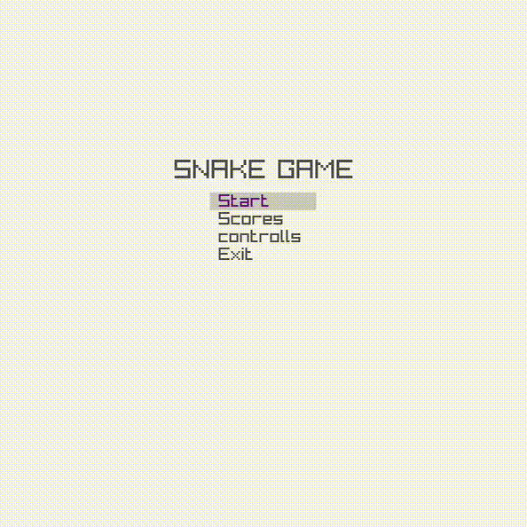
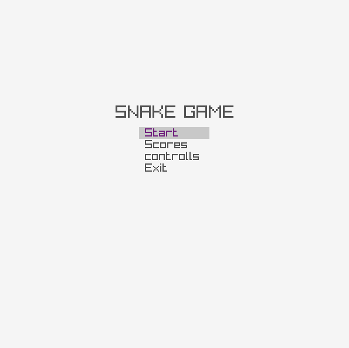
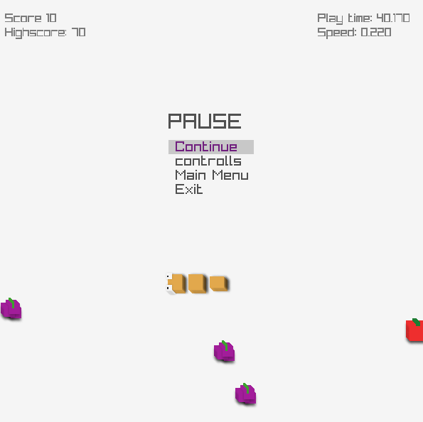
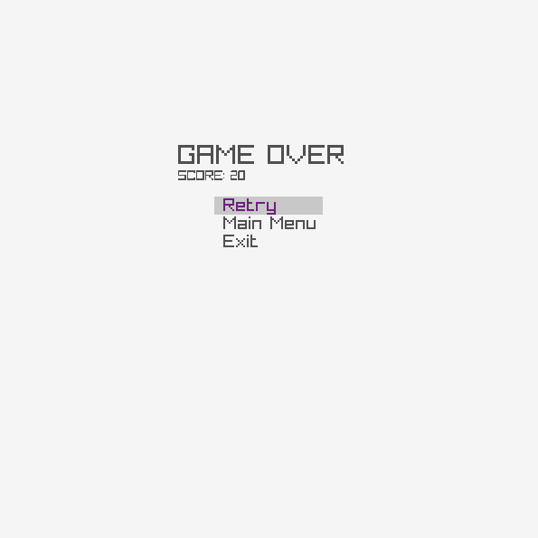
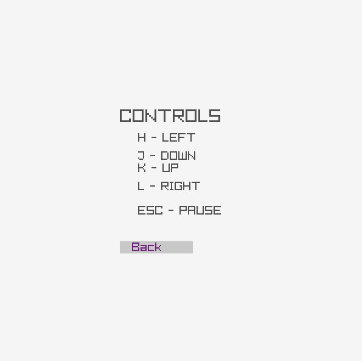
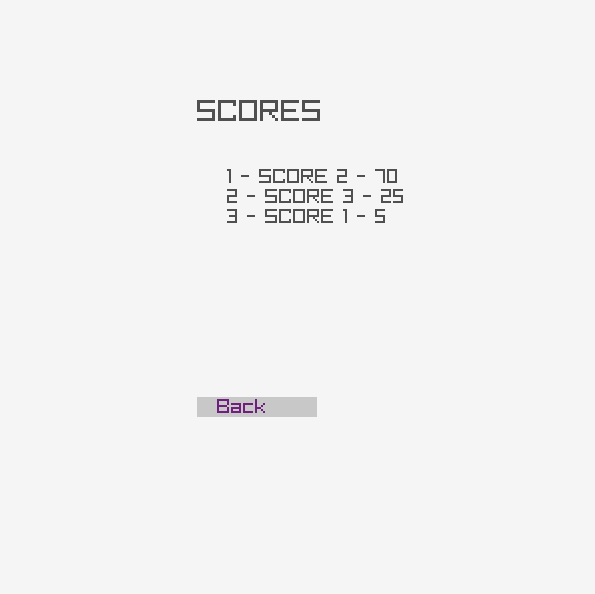
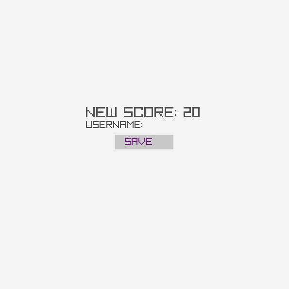

# Snake Game

**Author:** Leonardo Luz

[**Repository**](https://github.com/leonardo-luz/snake-game)

[](LICENSE.md)
[](README.md)

## Summary
1. [Description](#Description)
2. [Preview](#Preview)
3. [Requirements](#Requirements)
4. [Installation](#Installation)
5. [License](#License)

## Description

This project is a recreation of the classic Snake game, where the player controls a snake that grows longer with each food consumed. The game ends if the snake collides with the wall or itself. Special foods trigger specific effects, and the game tracks score and highscore, providing a competitive edge for players. The game includes multiple menus like Start, Pause, and Game Over, with a rich visual interface featuring images for foods and the snake.

<details><summary> Preview </summary>

  

  <details><summary> Menus </summary>

  1. Main Menu

  

  2. Pause Menu

  

  3. Game Over Menu

  

  4. Controls Menu

  

  5. Scores Menu

  

  6. New Score Menu

  

  </details>

  <details><summary> Assets </summary>

  1. Head

  

  2. Body

  

  3. Tail

  

  4. Apple

  

  5. Banana

  

  6. Berry

  

  </details>
</details>

## Requirements

- **OS**: Ubuntu
- **Dependencies**:
  - Raylib (for game development)
  - GCC (GNU Compiler Collection)
  - Make (for build automation)

### Installation

To install the necessary dependencies, run the following commands:

```
sudo apt install make gcc

```
After installing make and gcc, you will also need to install the Raylib library. <br/>
You can follow the official installation instructions for Raylib [here](https://www.raylib.com/).

#### Clone Repository
```
git clone https://github.com/leonardo-luz/snake-game
cd snake-game
```

#### Build & Run
```
make
./game
```

### License
This project is licensed under the MIT License - see the [LICENSE](LICENSE.md) file for details.
